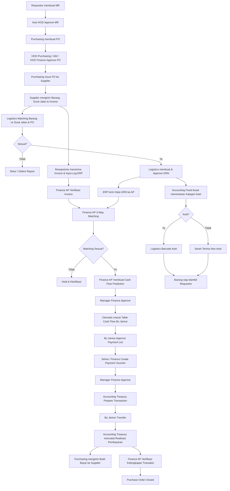
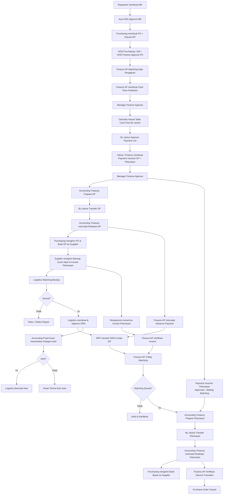
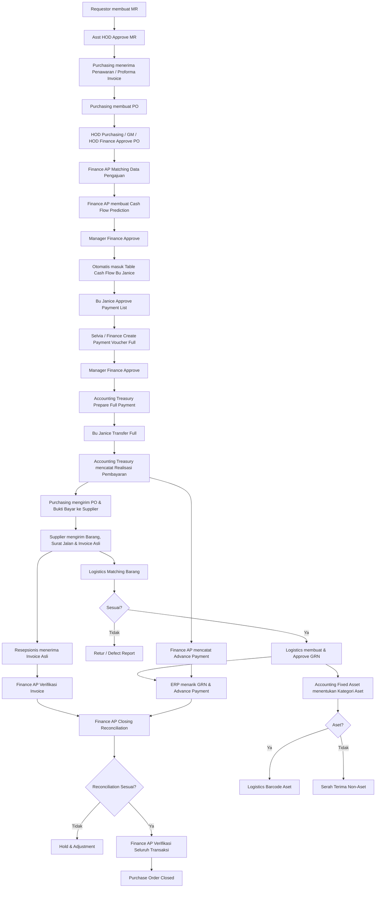

# MASTER FLOW DP DAN PEMBAYARAN FULL

## Standard Role

* **Finance (AP)** → Matching, Cash Flow Prediction, Advance Payment, Reconciliation, Closing PO.
* **Manager Finance** → Approval Cash Flow Prediction & Payment Voucher untuk semua jenis pembayaran.
* **Bu Janice (Director)** → Approval daftar pembayaran.
* **Selvia / Finance** → Create Payment Voucher.
* **HOD Finance** → Approval PO sesuai flow pengadaan.
* **Accounting (Treasury)** → Prepare transaksi & mencatat realisasi pembayaran.
* **Bu Janice (Pin Transfer)** → Eksekusi transfer.
* **Purchasing** → Mengirim PO / Bukti Bayar ke Supplier.
* **Accounting (Fixed Asset)** → Klasifikasi aset setelah GRN.

---

# 1. Flow COD / Pembayaran Setelah Barang Diterima

---

# 2. Flow DP Before GRN

---

# 3. Flow Pembayaran Full Sebelum GRN

---

## Standard Penutupan Semua Flow

**Bu Janice Transfer**
→ **Accounting Treasury Record Realisasi**
→ **Purchasing Kirim Bukti Bayar ke Supplier**
→ **Finance AP Verifikasi / Reconciliation**
→ **Purchase Order Closed**

Dengan standard ini, role ERP tidak berubah-ubah antara COD, DP, dan Full Payment.
