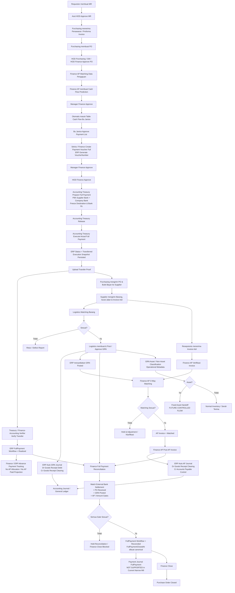
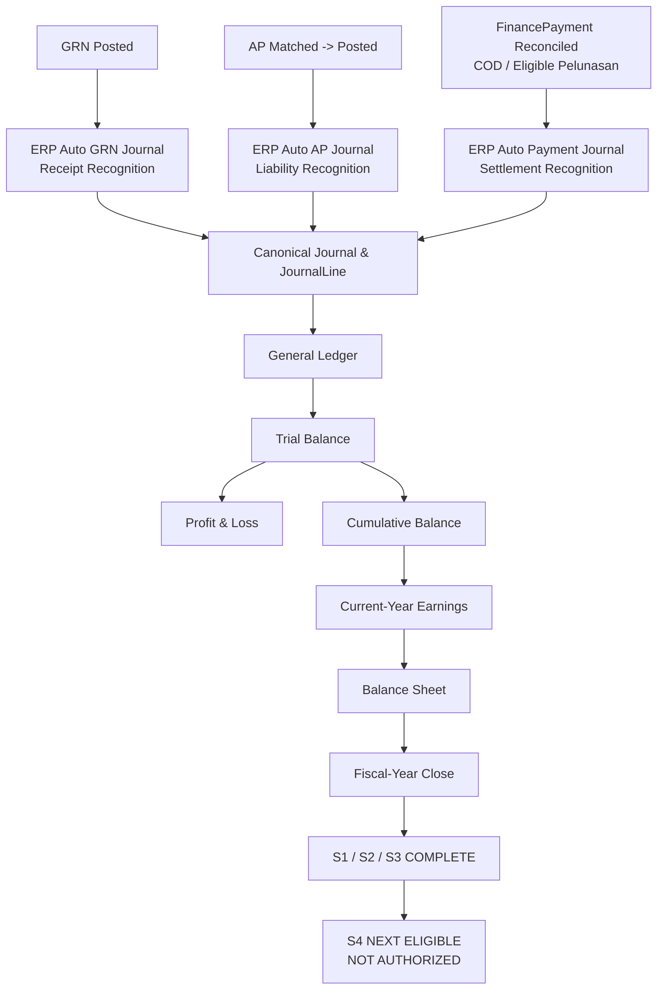

Bisa. Aku update **master flow kamu sebagai versi current-state NagoyaOne yang sudah kita bangun sampai M9 sekarang**, tapi tetap pakai gaya penamaan operasional seperti flow kamu.

Ada beberapa perubahan penting dibanding flow lama. Yang paling besar: **Bu Janice sebagai Director tetap approval, bukan eksekutor transfer**; eksekusi aktual `WaitingExecution → Transferred` dimiliki Treasury/payment executor. Setelah transfer sekarang juga ada pemisahan **Transferred → Upload Proof → Realized → External Bank Reconciliation → Closed**. Selain itu, di M9 sudah masuk jurnal otomatis GRN, AP, dan Payment Journal dalam boundary tertentu. 

Untuk Fixed Asset aku juga koreksi: klasifikasi Asset/Non-Asset dari GRN boleh tetap muncul sebagai operational metadata, tetapi **Asset Register, capitalization, depreciation, dan barcode asset belum boleh dianggap flow canonical yang sudah jadi**. Fixed Asset handoff dan barcode memang masih future boundary. 

# MASTER FLOW DP DAN PEMBAYARAN FULL — UPDATED NAGOYAONE CURRENT STATE

## Standard Role

* **Finance (AP)** → Verifikasi invoice, 3-Way Matching, AP Post, Cash Flow Prediction, payment allocation, Advance Payment tracking, Finance Close.
* **Manager Finance** → Approval Cash Flow Prediction dan Payment Voucher.
* **Bu Janice (Director)** → Approval daftar pembayaran. **Bukan transfer executor.**
* **Selvia / Finance** → Create Payment Voucher.
* **HOD Finance** → Final approval Payment Voucher.
* **Accounting / Treasury — Prepare** → Memilih **Supplier Bank Account + Company Bank Account**, lalu ERP freeze beneficiary dan company-bank/GL provenance.
* **Accounting / Treasury — Executor** → Release dan melakukan actual transfer.
* **Accounting / Treasury — Proof Uploader** → Upload bukti transfer.
* **Treasury / Finance-Accounting — Realization Verifier** → Verifikasi hasil transfer dan mengubah `Transferred → Realized`; actor ini harus memenuhi SoD terhadap executor/uploader.
* **Finance Reconciliation / Close** → Matching transaksi dengan external bank settlement, mengubah `Realized → Reconciled`, lalu Finance Close jika semua gate terpenuhi.
* **Purchasing** → Mengirim PO / Bukti Bayar ke Supplier.
* **ERP Accounting** → Auto Journal pada GRN Posted, AP Posted, dan Payment Reconciled yang memenuhi contract M9.
* **Accounting Fixed Asset** → **Future controlled handoff**; existing GRN Asset/Non-Asset classification belum berarti capitalization/depreciation.

Canonical payment truth tetap `FinancePaymentWorkflow`, bukan flag `AP Paid`, `PO Closed`, memo, atau marker lain. 

---

# 1. Flow COD / Pembayaran Setelah Barang Diterima

```mermaid
flowchart TD

    A["Requestor membuat MR"] --> B["Asst HOD Approve MR"]

    B --> C["Purchasing membuat PO"]

    C --> D["HOD Purchasing / GM / HOD Finance Approve PO"]

    D --> E["Purchasing Issue PO ke Supplier"]

    E --> F["Supplier mengirim Barang, Surat Jalan & Invoice"]

    F --> G["Logistics Matching Barang vs Surat Jalan & PO"]

    G --> H{"Sesuai?"}

    H -->|Tidak| H1["Retur / Defect Report"]

    H -->|Ya| I["Logistics membuat & Post / Approve GRN"]

    I --> GJ["ERP Auto Posting GRN Journal<br/>Dr Goods Receipt Debit<br/>Cr Goods Receipt Clearing"]

    GJ --> GL["Accounting Journal / General Ledger"]

    F --> J["Resepsionis menerima Invoice & Input Log ERP"]

    J --> K["Finance AP Verifikasi Invoice"]

    I --> L["ERP menyediakan GRN Posted ke AP"]

    K --> M["Finance AP 3-Way Matching"]

    L --> M

    M --> N{"Matching Sesuai?"}

    N -->|Tidak| N1["Hold & Klarifikasi"]

    N -->|Ya| O["AP Invoice = Matched"]

    O --> AP1["Finance AP Post AP Invoice<br/>Boleh sebelum / sesudah Realize<br/>tetapi wajib sebelum Finance Close"]

    AP1 --> APJ["ERP Auto Posting AP Journal<br/>Dr Goods Receipt Clearing<br/>Cr Accounts Payable Control"]

    APJ --> GL

    O --> P["Finance AP membuat Cash Flow Prediction<br/>+ FinancePaymentWorkflow COD"]

    P --> Q["Manager Finance Approve"]

    Q --> R["Otomatis masuk Table Cash Flow Bu Janice"]

    R --> S["Bu Janice Approve Payment List"]

    S --> T["Selvia / Finance Create Payment Voucher COD<br/>ERP Generate VoucherNumber"]

    T --> U["Manager Finance Approve Payment Voucher"]

    U --> V["HOD Finance Approve Payment Voucher"]

    V --> W["Accounting Treasury Prepare Transaction<br/>Pilih Supplier Bank + Company Bank<br/>ERP Freeze Payment Destination & Bank GL Provenance"]

    W --> X["Accounting Treasury Release / Ready for Execution"]

    X --> Y["Accounting Treasury Execute Actual Transfer"]

    Y --> Y1["ERP Status = Transferred<br/>Record Executor + Amount + Reference + Time"]

    Y1 --> Z["Accounting Treasury Upload Transfer Proof"]

    Z --> ZA["Treasury / Finance-Accounting Verifier<br/>Verify Transfer Outcome"]

    ZA --> ZB["ERP Status = Realized<br/>AP Paid Projection jika AP sudah Posted"]

    Z --> PC["Purchasing mengirim Bukti Bayar ke Supplier"]

    ZB --> RC["Finance Reconciliation<br/>Match dengan External Bank Settlement"]

    RC --> RD{"Bank Evidence Sesuai?"}

    RD -->|Tidak| RE["Hold Reconciliation / Klarifikasi"]

    RD -->|Ya| RF["ERP Status = Reconciled"]

    RF --> PJ{"Payment Journal M9 Eligible?<br/>COD + Exactly 1 AP Allocation<br/>Full Exact Match"}

    PJ -->|Ya| PG["ERP Auto Payment Journal<br/>Dr Accounts Payable Control<br/>Cr Company Bank GL"]

    PG --> GL

    PJ -->|Tidak| PH["No Automatic Payment Journal<br/>Fail Closed / Future Accounting Scope"]

    RF --> FC["Finance Close Check"]

    AP1 --> FC

    FC --> FCG{"All Allocation Complete<br/>All AP = Paid<br/>Proof + Reconciliation Complete?"}

    FCG -->|Tidak| FCH["Finance Close Blocked"]

    FCG -->|Ya| PO["Purchase Order Closed"]

    I --> FA["GRN Asset / Non-Asset Classification<br/>Operational Metadata"]

    FA --> FB{"Asset?"}

    FB -->|Ya| FC2["Fixed Asset Handoff<br/>FUTURE CONTROLLED FLOW<br/>Asset Register / Capitalization / Depreciation belum canonical"]

    FB -->|Tidak| FD["Normal Inventory / Serah Terima"]
```



Ada satu nuance yang sekarang penting: untuk COD, **Realize boleh terjadi ketika allocated AP masih `Matched`**, tetapi AP itu belum boleh dianggap Finance Close complete. Kalau AP baru `Posted` setelah Realize, Paid projection dapat dilakukan setelah itu; Finance Close menunggu semua allocation lengkap dan AP canonical `Paid`. 

Dan AP accounting sekarang bukan saat Match. Recognition accounting AP baru pada **successful `Matched → Posted`**, menghasilkan `Dr GoodsReceiptClearing / Cr AccountsPayableControl`. 

---

# 2. Flow DP Before GRN

```mermaid
flowchart TD

    A["Requestor membuat MR"] --> B["Asst HOD Approve MR"]

    B --> C["Purchasing membuat PO + Klausul DP"]

    C --> D["HOD Purchasing / GM / HOD Finance Approve PO"]

    D --> E["Finance AP Matching Data Pengajuan"]

    E --> F["Finance AP membuat Cash Flow Prediction"]

    F --> G["Manager Finance Approve"]

    G --> H["Otomatis masuk Table Cash Flow Bu Janice"]

    H --> I["Bu Janice Approve Payment List"]

    I --> J["Selvia / Finance Create Payment Voucher<br/>DP + Pelunasan<br/>1 Economic Pair / 2 Payment Workflows<br/>2 VoucherNumber"]

    J --> K["Manager Finance Approve"]

    K --> L["HOD Finance Approve"]

    L --> DP1["DP Workflow"]

    L --> PV["Pelunasan Workflow<br/>Approved / Waiting Matching"]

    DP1 --> M["Accounting Treasury Prepare DP<br/>Pilih Supplier Bank + Company Bank<br/>Freeze Destination & Bank GL"]

    M --> M1["Accounting Treasury Release DP"]

    M1 --> N["Accounting Treasury Execute Actual DP Transfer"]

    N --> N1["ERP Status DP = Transferred"]

    N1 --> O["Upload DP Transfer Proof"]

    O --> P["Treasury / Finance-Accounting Verifier<br/>Verify DP"]

    P --> Q["ERP Status DP = Realized"]

    Q --> Q1["Finance / ERP Advance Payment Tracking<br/>Projection / Reference<br/>Bukan independent payment truth"]

    Q --> DPB["Finance Reconcile DP<br/>vs External Bank Settlement"]

    DPB --> DPC["DP = Reconciled"]

    O --> R["Purchasing mengirim PO & Bukti DP ke Supplier"]

    R --> S["Supplier mengirim Barang, Surat Jalan & Invoice Pelunasan"]

    S --> T["Logistics Matching Barang"]

    T --> U{"Sesuai?"}

    U -->|Tidak| U1["Retur / Defect Report"]

    U -->|Ya| V["Logistics membuat & Post / Approve GRN"]

    V --> GJ["ERP Auto GRN Journal<br/>Dr Goods Receipt Debit<br/>Cr Goods Receipt Clearing"]

    GJ --> GL["Accounting Journal / General Ledger"]

    S --> W["Resepsionis menerima Invoice Pelunasan"]

    W --> X["Finance AP Verifikasi Invoice"]

    V --> Y["ERP menyediakan GRN + DP Workflow"]

    X --> Z["Finance AP 3-Way Matching"]

    Y --> Z

    Z --> AA{"Matching Sesuai?"}

    AA -->|Tidak| AA1["Hold & Klarifikasi"]

    AA -->|Ya| AB["AP Invoice = Matched"]

    AB --> AC["Finance AP menentukan Pelunasan Allocation<br/>Gross AP dikurangi DP secara canonical"]

    AC --> AD["Finance AP Post AP Invoice<br/>Boleh sebelum / sesudah Realize<br/>Wajib sebelum Finance Close"]

    AD --> APJ["ERP Auto AP Journal<br/>Dr Goods Receipt Clearing<br/>Cr Accounts Payable Control"]

    APJ --> GL

    AC --> AE["Accounting Treasury Prepare Pelunasan<br/>Freeze Supplier Bank + Company Bank"]

    PV --> AE

    AE --> AF["Accounting Treasury Release Pelunasan"]

    AF --> AG["Accounting Treasury Execute Pelunasan"]

    AG --> AH["ERP Status Pelunasan = Transferred"]

    AH --> AI["Upload Transfer Proof Pelunasan"]

    AI --> AJ["Treasury / Finance-Accounting Verifier<br/>Verify Pelunasan"]

    AJ --> AK["Pelunasan = Realized<br/>AP Paid Projection jika AP sudah Posted"]

    AI --> AL["Purchasing mengirim Bukti Bayar ke Supplier"]

    AK --> AM["Finance Reconcile Pelunasan<br/>vs External Bank Settlement"]

    AM --> AN["Pelunasan = Reconciled"]

    AN --> PJ{"Payment Journal Eligible?<br/>Exactly 1 AP Allocation<br/>Full Exact Match"}

    PJ -->|Ya| PJ1["ERP Auto Payment Journal<br/>Dr Accounts Payable Control<br/>Cr Company Bank GL"]

    PJ1 --> GL

    PJ -->|Tidak| PJ2["No Automatic Payment Journal<br/>Multi-AP / Unsupported Current M9 Scope"]

    DPC --> CL["Finance Close DP + Pelunasan Pair"]

    AN --> CL

    AD --> CL

    CL --> CG{"DP Reconciled + Pelunasan Reconciled<br/>Proof Complete<br/>All Allocated AP = Paid?"}

    CG -->|Tidak| CH["Finance Close Blocked"]

    CG -->|Ya| CI["Purchase Order Closed"]

    V --> FA["GRN Asset / Non-Asset Classification<br/>Operational Metadata"]

    FA --> FB{"Asset?"}

    FB -->|Ya| FC["Fixed Asset Handoff<br/>FUTURE CONTROLLED FLOW"]

    FB -->|Tidak| FD["Normal Inventory / Serah Terima"]
```



Di sini ada koreksi yang cukup penting terhadap master flow lama kamu: **DP dan Pelunasan memang satu economic/package relationship, tetapi masing-masing adalah individual `FinancePaymentWorkflow` dan masing-masing punya VoucherNumber berbeda**. Jadi bukan satu nomor PV dipakai dua pembayaran. 

Untuk Pelunasan multi-AP, DP netting juga sudah punya aturan canonical: menggunakan keseluruhan eligible gross AP set, DP dibagi pro-rata, residual deterministic, dan total allocation harus sama persis dengan amount Pelunasan. 

Tetapi pada sisi accounting M9 saat ini ada boundary: **automatic Payment Journal hanya mendukung COD/Pelunasan dengan tepat satu AP allocation yang full exact-match**. Multi-AP Pelunasan tidak boleh diam-diam dibuat jurnal seolah-olah sama; harus fail-closed / menunggu future accounting scope. 

---

# 3. Flow Pembayaran Full Sebelum GRN



Full Payment Before GRN memang berbeda dengan COD. Canonical flow **tidak membuat AP `Paid` sebagai pembayaran kedua**, karena pembayaran supplier sebenarnya sudah terjadi sebelum GRN. 

Untuk FullPayment, `Reconciled` juga tidak boleh hanya karena transfer sudah ada. Existing FullPayment close tetap membutuhkan PO Received, GRN Posted, AP/amount requirements, lalu ditambah external bank settlement evidence. Marker `FullPaymentClosedAt` hanya boleh lahir dari canonical full-payment reconciliation tersebut. 

Dan yang perlu kita tandai di master flow: **current M9 Payment Journal belum mencakup FullPaymentBeforeGrn maupun DownPayment**. Contract saat ini hanya COD dan Pelunasan exact one-AP allocation. Jadi jangan digambar seolah DP/Full sudah punya automatic bank/payment journal accounting yang complete. 

---

# 4. Standard Accounting Downstream yang Sekarang Sudah Terhubung

Ini bagian yang sebelumnya belum ada di master flow kamu, padahal sekarang sudah penting karena M9 kita sudah jauh berjalan.



GRN Journal, AP Journal, Company Bank Account provenance, Payment Journal, General Ledger, Trial Balance, Cumulative Balance, Current-Year Earnings, dan Balance Sheet sudah canonical. Fiscal-Year Close sendiri baru **S1/S2/S3 complete; overall belum complete dan S4 masih next eligible/not authorized**.  

---

## Standard Penutupan Semua Flow — UPDATED

Versi lama:

**Bu Janice Transfer → Treasury Record Realisasi → AP Reconciliation → PO Closed**

sekarang sebaiknya diganti menjadi:

```text
Bu Janice / Director Approve Payment List
↓
Payment Voucher Approved
↓
Accounting Treasury Prepare
- pilih Supplier Bank Account
- pilih Company Bank Account
- freeze beneficiary + company-bank/GL provenance
↓
Accounting Treasury Release
↓
Accounting Treasury Execute Actual Transfer
↓
Transferred
- executor
- actual transferred amount
- transfer reference
- transferred time
↓
Upload Transfer Proof
↓
Treasury / Finance-Accounting Verify
↓
Realized
↓
Purchasing Kirim Bukti Bayar ke Supplier
↓
Finance External Bank Settlement Reconciliation
↓
Reconciled
↓
Accounting Payment Journal
HANYA jika workflow termasuk boundary M9 yang didukung
↓
Finance Close / Completion Gate
↓
Purchase Order Closed
```

`Transferred` dan `Realized` juga sekarang **bukan hal yang sama**. Transferred berarti actual transfer sudah dieksekusi dengan execution snapshot; proof boleh di-upload setelah itu, tetapi workflow tidak boleh menjadi Realized sebelum persisted transfer proof dan SoD gate terpenuhi. 

Lalu `Realized` dan `Reconciled` juga berbeda: Realized membuktikan outcome transfer, sedangkan Reconciled berarti payment tersebut sudah matched dengan **external bank settlement evidence**. Close untuk transaksi baru membutuhkan reconciliation tersebut. 

### Jadi struktur besar ERP kita sekarang

```text
MR
→ Approval MR
→ PO
→ Approval PO
→ Supplier
→ GRN / Receiving
→ Inventory
→ GRN Accounting Journal
→ AP Invoice
→ 3-Way Matching
→ AP Posted
→ AP Accounting Journal
→ Cash Flow
→ Director Approval
→ Payment Voucher
→ Treasury Prepare
→ Freeze Supplier Bank + Company Bank
→ Execute Transfer
→ Transfer Proof
→ Realize
→ External Bank Reconcile
→ Payment Journal jika eligible
→ Finance Close
→ PO Close
→ GL
→ Trial Balance
→ Financial Statements
→ Fiscal-Year Close
```

Dengan bentuk ini, **flow COD, DP, dan Full tidak lagi berubah-ubah siapa yang punya payment truth**. Ketiganya memakai `FinancePaymentWorkflow`; yang berbeda hanyalah **timing GRN/AP, payment topology, allocation, dan accounting treatment yang memang berbeda secara bisnis**. 

Dan satu hal yang sebaiknya kita pertahankan sebagai label merah di master flow: **Fixed Asset capitalization/depreciation serta complete DP/Full prepayment accounting belum boleh dianggap selesai hanya karena flow operasional pembayarannya sudah ada.** Itu masih boundary lanjutan, bukan sesuatu yang boleh ERP infer sendiri. 
