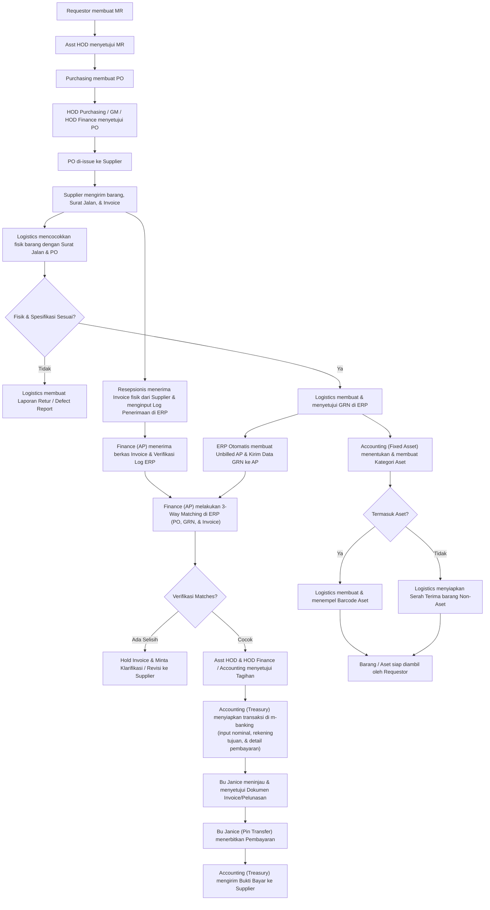
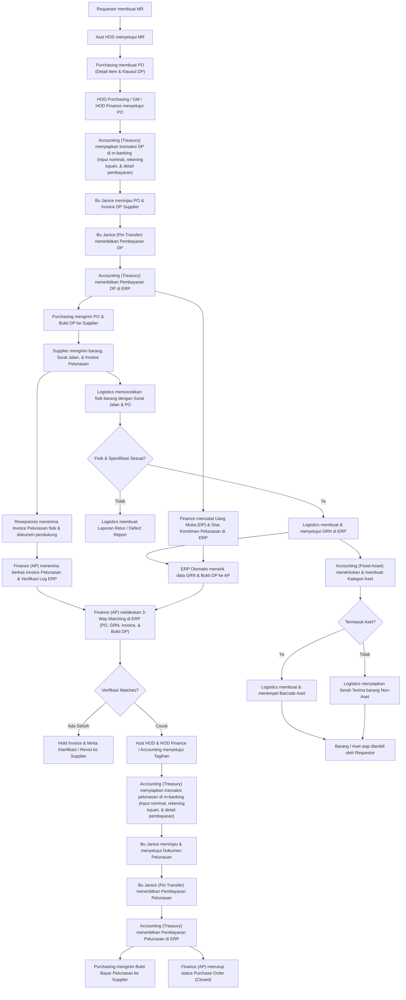
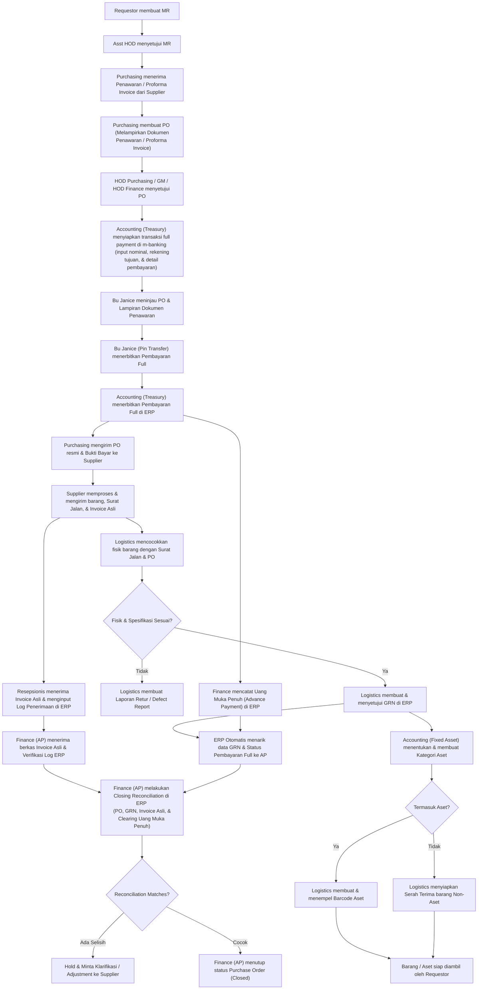

Berikut adalah perbaikan dan penyelarasan menyeluruh untuk dokumen **Master Flow DP dan Pembayaran Full**.

### 💡 Poin Utama Konsistensi yang Diselaraskan:

1. **Pemisahan Peran Accounting (Treasury) vs Finance (AP):**
* **Bu Janice (Pin Transfer)**: Mengeksekusi transfer fisik dana via e-banking setelah transaksi disiapkan di m-banking.
* **Accounting (Treasury)**: Menyiapkan transaksi pembayaran di m-banking (input nominal, rekening tujuan, dan detail pembayaran), menerbitkan bukti bayar / voucher pembayaran resmi di ERP, dan mengirimkan bukti transfer ke Supplier.
* **Finance (AP)**: Menerima invoice, verifikasi *3-Way Matching*, pencatatan *Advance Payment*, dan melakukan *Closing Reconciliation*.

2. **Standardisasi Pintu Masuk Invoice (Resepsionis):** Di semua alur, Invoice fisik/asli yang datang dari Supplier konsisten diterima oleh **Resepsionis** untuk diinput log penerimaannya ke ERP sebelum diverifikasi oleh **Finance (AP)**.
3. **Pemberian Tagging Aset Paralel:** Di ketiga alur, setelah GRN disetujui, **Accounting (Fixed Asset)** menentukan kategori aset, sehingga Logistik bisa langsung mencetak barcode tanpa perlu menunggu proses administrasi pembayaran di **Accounting (Treasury)** selesai.
4. **Penyelarasan Narasi & Diagram:** Narasi di setiap alur telah disesuaikan 100% mengikuti langkah demi langkah yang ada pada flowchart terbaru.

---

# Master Flow DP dan Pembayaran Full

Dokumen ini dibagi menjadi 3 flowchart terpisah agar lebih mudah dibaca dan dikoreksi:

1. Flow COD / pembayaran setelah barang diterima.
2. Flow DP before GRN.
3. Flow pembayaran full sebelum GRN.

---

## 1. Flow COD / Pembayaran Setelah Barang Diterima

### Koreksi Utama

* Mengubah aktor penerima invoice dan pencocokan tagihan menjadi **Finance (AP)** dengan bantuan log penerimaan oleh **Resepsionis**.
* Mengubah eksekusi transfer ke **Bu Janice (Pin Transfer)** dengan tahapan persiapan transaksi di m-banking oleh **Accounting (Treasury)** sebelum PIN diinput.
* Mengubah pembuatan kategori aset menjadi **Accounting (Fixed Asset)** yang berjalan paralel setelah GRN.

### Narasi Proses COD / Pembayaran Setelah Barang Diterima

1. Requestor membuat `MR`.
2. `MR` disetujui oleh `Asst HOD`.
3. Purchasing membuat `PO`.
4. `PO` disetujui oleh `HOD Purchasing`, `GM`, dan `HOD Finance` untuk kontrol anggaran.
5. `PO` dikirim ke Supplier.
6. Supplier mengirimkan barang beserta `Surat Jalan` dan `Invoice`.
7. Tim Logistics mencocokkan fisik barang yang datang dengan `Surat Jalan` dan dokumen `PO`.
8. Jika fisik dan spesifikasi sesuai, Logistics membuat dan menyetujui `GRN` di ERP. (Jika tidak sesuai, Logistics membuat Laporan Retur).
9. Secara terpisah, Resepsionis menerima berkas `Invoice` fisik dari Supplier dan menginput Log Penerimaan di ERP.
10. `Finance (AP)` menerima berkas `Invoice` fisik dan memverifikasi Log Penerimaan di ERP.
11. ERP secara otomatis membuat *Unbilled AP* dan mengirimkan data `GRN` ke modul `Finance (AP)`.
12. `Finance (AP)` melakukan *3-Way Matching* di ERP dengan mencocokkan `PO`, `GRN`, dan `Invoice`.
13. Jika hasil matching sesuai, tagihan disetujui oleh `Asst HOD` dan `HOD Finance / Accounting`.
14. `Accounting (Treasury)` menyiapkan transaksi pembayaran di m-banking dengan menginput nominal, rekening tujuan, dan detail pembayaran lainnya.
15. Bu Janice meninjau dokumen tagihan dan memberikan persetujuan pelunasan.
16. `Bu Janice (Pin Transfer)` mengeksekusi transfer pembayaran via e-banking.
17. `Accounting (Treasury)` menerbitkan voucher pembayaran di ERP dan mengirimkan bukti bayar ke Supplier.
18. Paralel setelah `GRN` terbit, `Accounting (Fixed Asset)` menentukan dan membuat Kategori Aset di ERP.
19. Logistics menerima data klasifikasi aset dari sistem. Jika barang termasuk aset, Logistics mencetak dan menempelkan barcode aset.
20. Jika bukan aset, barang disiapkan untuk prosedur serah terima Non-Aset.
21. Barang atau aset selesai diproses dan siap diambil oleh Requestor.

---
Berikut adalah perbaikan dan penyelarasan untuk **Flow 2 (Flow DP Before GRN)** beserta narasi prosesnya.

Perubahan telah disesuaikan dengan permintaanmu:

1. **Penerbit Bukti Bayar Pelunasan ke Supplier:** Dikirim oleh **Purchasing**.
2. **Status PO:** Ditutup secara resmi oleh **Finance (AP)** menjadi *Purchase Order (Closed)* setelah transaksi pembayaran pelunasan selesai diterbitkan oleh **Accounting (Treasury)**.
3. **Penerimaan Resepsionis & Approval:** Menyelaraskan teks penerimaan berkas di Resepsionis serta persetujuan tagihan oleh `Asst HOD & HOD Finance / Accounting`.

---

## 2. Flow DP Before GRN

### Koreksi Utama

* Konsistensi aktor eksekusi transfer pada `Bu Janice (Pin Transfer)` dengan tahapan persiapan transaksi di m-banking oleh `Accounting (Treasury)` sebelum PIN diinput.
* Pengaliran data DP ke jurnal `Finance (Advance Payment)` di ERP.
* Pengiriman bukti bayar pelunasan ke Supplier dilakukan oleh **Purchasing**, dilanjutkan dengan penutupan status **Purchase Order (Closed)** oleh **Finance (AP)**.

---

### Narasi Proses DP Before GRN

1. Requestor membuat `MR`.
2. `MR` disetujui oleh `Asst HOD`.
3. Purchasing membuat `PO` yang memuat detail item beserta klausul persetujuan `DP`.
4. `PO` disetujui oleh `HOD Purchasing`, `GM`, dan `HOD Finance`.
5. `Accounting (Treasury)` menyiapkan transaksi `DP` di m-banking dengan menginput nominal, rekening tujuan, dan detail pembayaran.
6. Bu Janice meninjau dokumen `PO` dan pengajuan invoice `DP` dari Supplier.
7. `Bu Janice (Pin Transfer)` mengeksekusi transfer pembayaran `DP`.
8. `Accounting (Treasury)` menerbitkan bukti pembayaran `DP` di ERP.
9. Purchasing mengirimkan `PO` resmi beserta bukti bayar `DP` ke Supplier agar pesanan diproses.
10. Finance mencatat pembayaran tersebut sebagai Uang Muka (`Advance Payment`) dan mencatat sisa komitmen pelunasan di ERP.
11. Supplier mengirimkan barang beserta `Surat Jalan` dan `Invoice Pelunasan`.
12. Tim Logistics mencocokkan fisik barang dengan `Surat Jalan` dan `PO`. Jika sesuai, Logistics membuat dan menyetujui `GRN` di ERP.
13. Resepsionis menerima `Invoice Pelunasan` fisik beserta dokumen pendukung lainnya dan menginput Log Penerimaan di ERP.
14. `Finance (AP)` menerima berkas `Invoice Pelunasan` fisik dan memverifikasi Log Penerimaan di ERP.
15. ERP secara otomatis menarik data `GRN` serta catatan pembayaran `DP` sebelumnya ke modul `Finance (AP)`.
16. `Finance (AP)` melakukan *3-Way Matching* di ERP dengan mencocokkan `PO`, `GRN`, `Invoice Pelunasan`, dan `Bukti DP`.
17. Tagihan disetujui oleh `Asst HOD` dan `HOD Finance / Accounting`.
18. `Accounting (Treasury)` menyiapkan transaksi pelunasan di m-banking dengan menginput nominal, rekening tujuan, dan detail pembayaran.
19. Bu Janice meninjau dan menyetujui dokumen pelunasan.
20. `Bu Janice (Pin Transfer)` mengeksekusi transfer pembayaran pelunasan.
21. `Accounting (Treasury)` menerbitkan bukti pembayaran pelunasan di ERP.
22. **Purchasing** mengirimkan bukti bayar pelunasan ke Supplier.
23. **Finance (AP)** memverifikasi kelengkapan seluruh transaksi dan mengubah status dokumen menjadi `Purchase Order (Closed)`.
24. Paralel setelah `GRN` disetujui, `Accounting (Fixed Asset)` menentukan dan membuat Kategori Aset di ERP.
25. Logistics menerima data filter aset; jika termasuk aset, Logistics mencetak dan menempelkan barcode aset. Jika non-aset, disiapkan untuk serah terima.
26. Barang atau aset selesai diproses secara administrasi dan fisik, serta siap diambil oleh Requestor.

---

## 3. Flow Pembayaran Full Sebelum GRN

### Koreksi Utama

* Menyelaraskan awal alur di mana Purchasing menerima dokumen Penawaran / Proforma Invoice dari Supplier sebagai dasar pengajuan bayar.
* Menyelaraskan peran **Resepsionis** saat barang fisik dan Invoice Asli tiba untuk kebutuhan penutupan jurnal (*Closing Reconciliation*).
* Memisahkan penutupan status PO oleh **Finance (AP)** dan pembuatan kategori aset oleh **Accounting (Fixed Asset)**.

### Narasi Proses Pembayaran Full Sebelum GRN

1. Requestor membuat `MR`.
2. `MR` disetujui oleh `Asst HOD`.
3. Purchasing menerima dokumen Penawaran / Proforma Invoice dari Supplier.
4. Purchasing membuat `PO` dengan metode pembayaran lunas di awal dan melampirkan dokumen Penawaran/Proforma Invoice tersebut di ERP.
5. `PO` disetujui oleh `HOD Purchasing`, `GM`, dan `HOD Finance`.
6. `Accounting (Treasury)` menyiapkan transaksi pembayaran full di m-banking dengan menginput nominal, rekening tujuan, dan detail pembayaran.
7. Bu Janice meninjau dokumen `PO` beserta lampiran dokumen Penawaran/Proforma Invoice.
8. `Bu Janice (Pin Transfer)` mengeksekusi pembayaran lunas via e-banking.
9. `Accounting (Treasury)` menerbitkan bukti pembayaran full di ERP.
10. Purchasing mengirimkan `PO` resmi dan bukti bayar lunas ke Supplier agar barang diproses dan dikirim.
11. Finance mencatat transaksi tersebut sebagai Uang Muka Penuh (*Advance Payment*) di ERP (belum diakui sebagai biaya/aset karena barang belum diterima).
12. Supplier memproses pesanan dan mengirimkan barang beserta `Surat Jalan` dan `Invoice Asli` / Faktur Pajak.
13. Logistics mencocokkan fisik barang yang datang dengan `Surat Jalan` dan `PO`. Jika sesuai, Logistics membuat dan menyetujui `GRN` di ERP.
14. Resepsionis menerima `Invoice Asli` dari Supplier dan menginput Log Penerimaan di ERP.
15. `Finance (AP)` menerima berkas `Invoice Asli` fisik dan memverifikasi Log Penerimaan di ERP.
16. ERP secara otomatis menarik data `GRN` dan status pembayaran *Advance Payment* ke modul `Finance (AP)`.
17. `Finance (AP)` melakukan *Closing Reconciliation* di ERP dengan mencocokkan `PO`, `GRN`, `Invoice Asli`, dan melakukan *clearing* akun Uang Muka Penuh.
18. Jika reconciliation sesuai, `Finance (AP)` mengoperasikan penutupan status `Purchase Order` menjadi *Closed*.
19. Paralel setelah `GRN` disetujui, `Accounting (Fixed Asset)` menentukan dan membuat Kategori Aset di ERP.
20. Logistics menerima data filter aset; jika barang termasuk aset, Logistics mencetak dan menempelkan barcode aset.
21. Jika barang non-aset, Logistics menyiapkan prosedur serah terima barang Non-Aset.
22. Barang atau aset selesai diproses secara administrasi dan fisik, serta siap diambil oleh Requestor.

---

## Catatan Tambahan untuk Implementasi ERP

* **Segregation of Duties (SoD):** Pemisahan peran antara `Logistics` (Inventory), `Resepsionis` (Document Control), `Finance (AP)` (Accounts Payable), `Accounting (Fixed Asset)` (Asset Management), `Accounting (Treasury)` (Payment Execution), dan `Bu Janice` (Approval & Transfer Authority) dalam diagram di atas sudah memenuhi kriteria kontrol internal standar ERP (*Good Corporate Governance*).
* **Otomasi ERP:** Seluruh proses transisi data bertanda *ERP Otomatis* tidak lagi memerlukan penginputan ulang data secara manual oleh staff, sehingga mengurangi potensi *human error*.
